# Instructions and Link

Haven is a private, end-to-end encrypted chat app. This page is
everything you need to start using it: the link, how to sign up, how
to add a friend, and how to reach me directly.

## Open Haven

**https://haven.taila6d3cb.ts.net**

Works in any modern browser, desktop or mobile. Nothing to install.

## My contact card

Paste this into Haven's "Add by contact card…" box (see step 5 below)
to send me a request directly, without searching:

```
haven1:ProcRingZero:0bd834d930058a47fbd089f759b86e1bd28186fc2eb2e7e828e507c47ccc536b
```

## 1. Create an account

Open the link above and click **Create account**. Pick any username
(it just needs to be unique — Haven will tell you if it's taken) and a
password. Nothing here is tied to your real name, email, or phone
number.

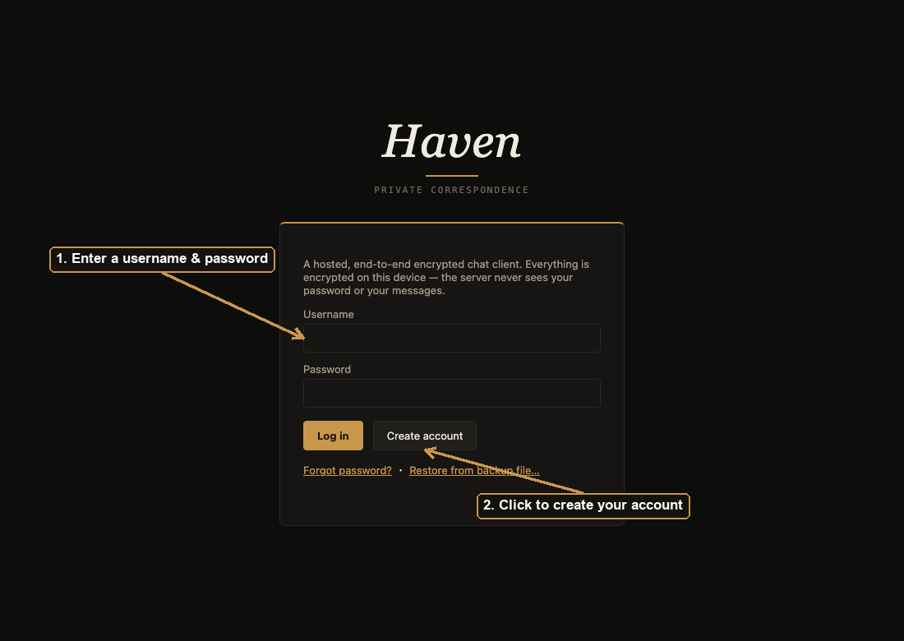

Fill in your username and password, then click **Create account**.

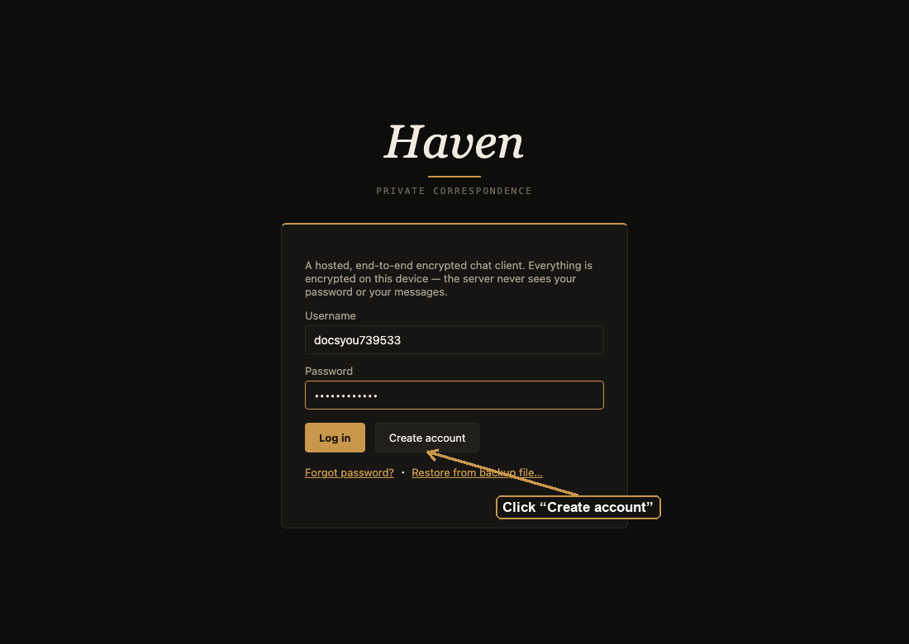

## 2. Save your recovery phrase

Right after you sign up, Haven shows you a 12-word recovery phrase.
This is shown **exactly once** — it's the only way back into your
account if you forget your password, since Haven never sees your
password itself and can't reset it for you. Write it down somewhere
safe (a password manager, a piece of paper — not a screenshot you'll
lose) before clicking through.

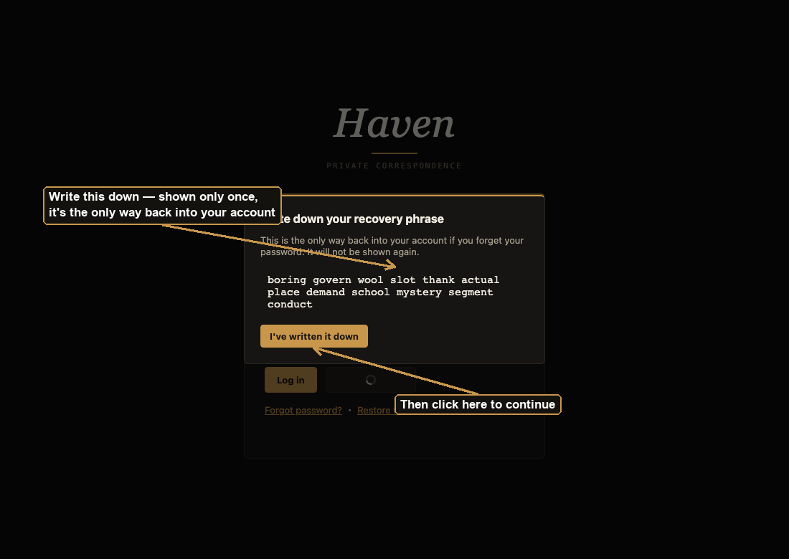

## 3. Find your way around

Once you're in, the sidebar has three tabs: **Chats** (your
conversations), **Requests** (contact requests waiting on you — more
on this below), and **Settings** (your avatar, your own contact card,
and privacy toggles). The search box at the top finds other Haven
users by username.

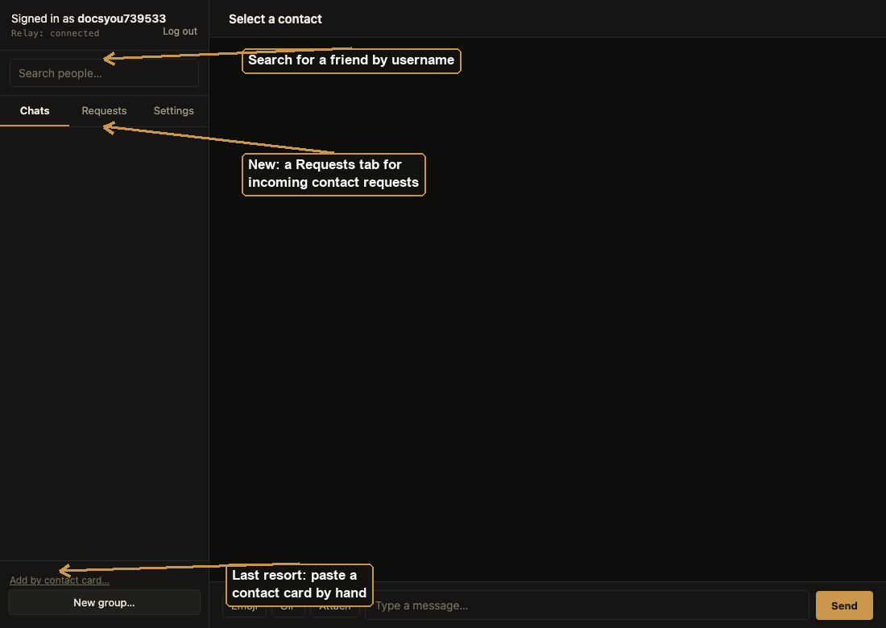

## 4. Add a contact — search by username

Adding someone is **invite-based**: you can't just message a stranger,
and a stranger can't just message you. Type their username in the
search box at the top of the sidebar.

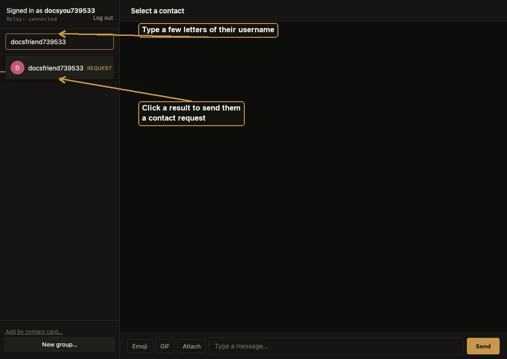

Click their name to send them a contact request.

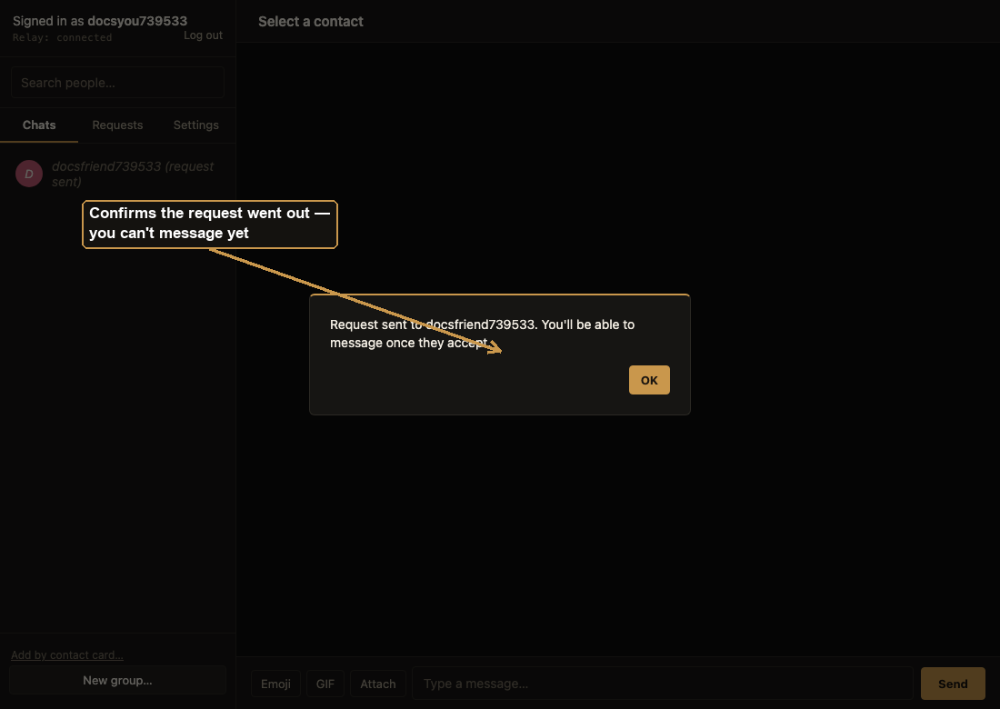

Until they respond, they show up in your Chats list as pending — there's
nothing to open yet.

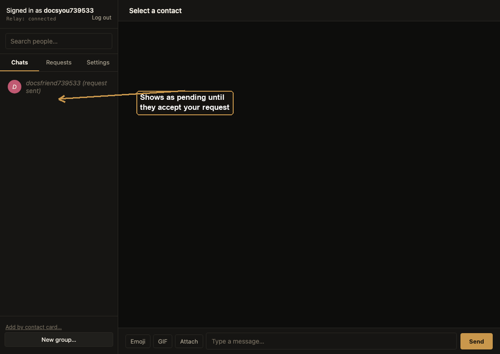

## 5. Accepting a request

When someone sends *you* a request, it lands in your **Requests** tab,
badged with a count so you don't miss it. From there you can **Accept**
(you're now mutual contacts and can message freely) or **Decline**
(the request is quietly dropped — they aren't notified either way).

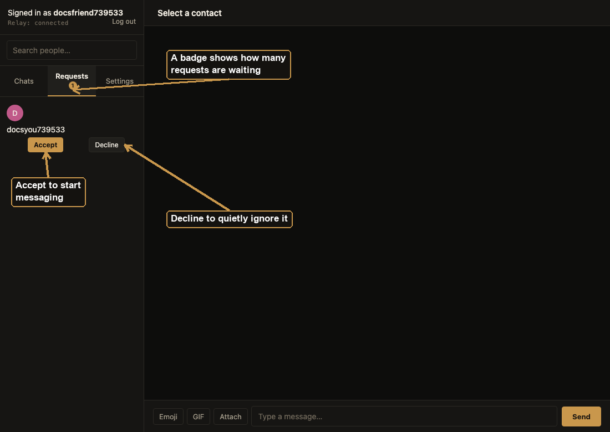

Only once a request is accepted can either side send a message — this
is true in both directions, so accepting someone's request is exactly
as deliberate as sending one.

## 6. Chatting

Once you're connected, click their name in the Chats tab to open the
conversation. Everything you send is end-to-end encrypted — Haven's
server never sees the plaintext.

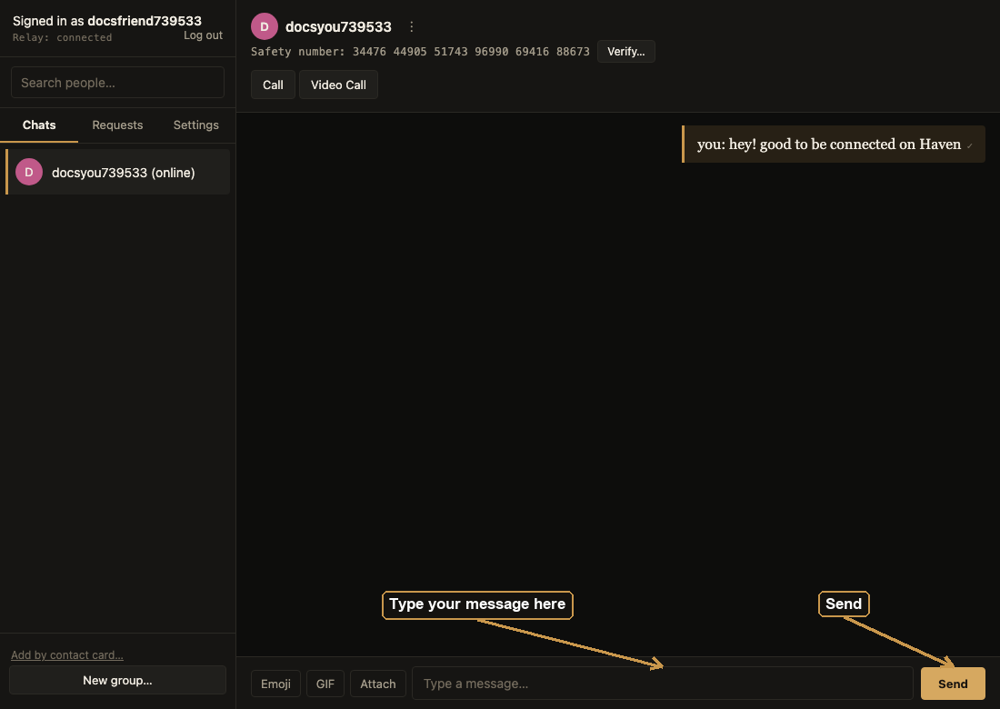

Every chat has a **safety number** at the top. Read it aloud to your
contact over a call (or compare it any way you trust) to confirm
you're both actually talking to each other, with no one in the middle.

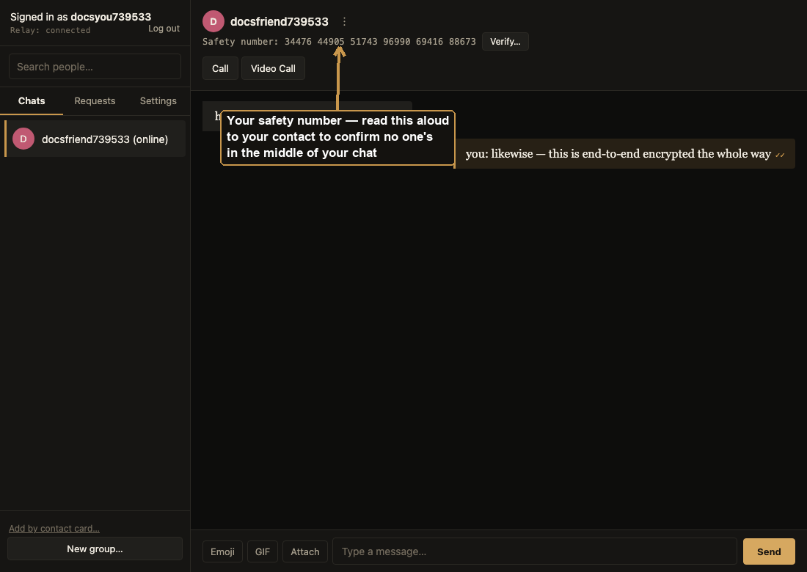

## 7. Sharing your own contact card

If you'd rather skip search entirely and just hand someone a direct
link to you, open **Settings → Show my contact card** and copy it to
them however you like (text, email, in person).

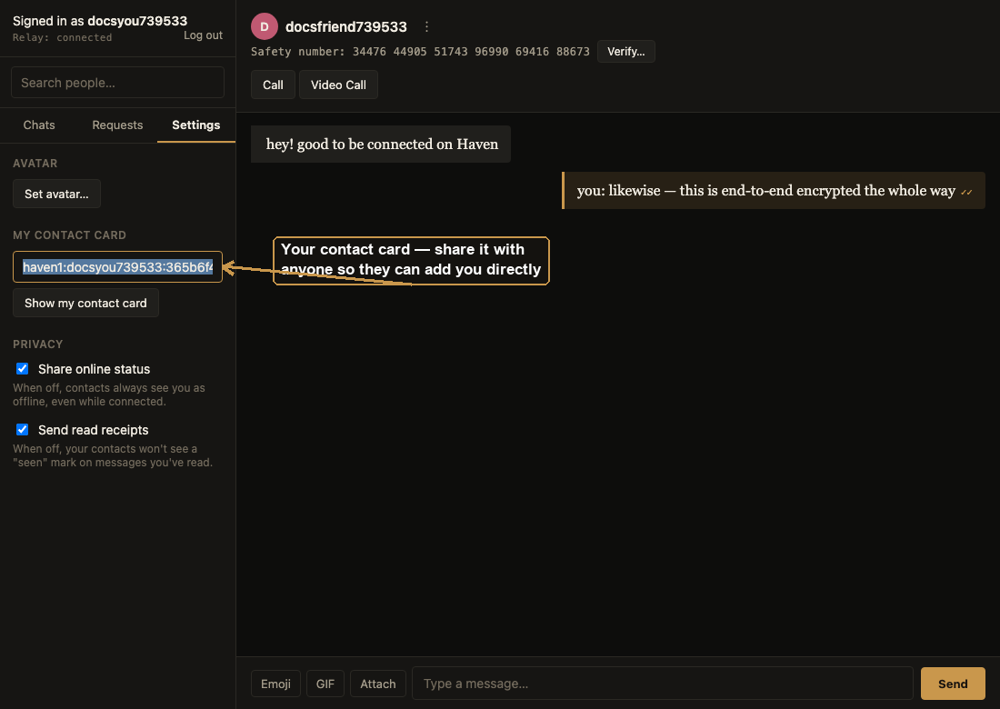

## 8. Last resort: paste a contact card

Search covers almost every case, but if you already have someone's
contact card (like mine above) and don't want to search for them,
**Add by contact card…** at the bottom of the Chats tab is a small,
de-emphasized fallback that does the same thing search does — it sends
them a request, it doesn't add them outright.

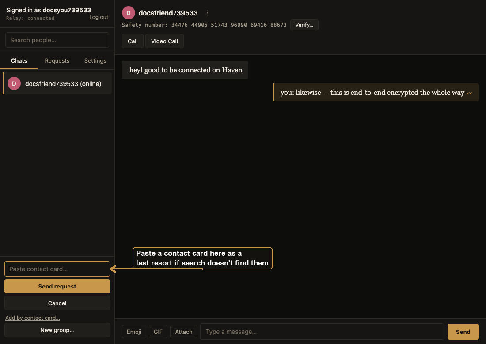

---

That's it — sign up, search for a username (or paste a card), send or
accept a request, and start talking. See [README.md](README.md) for
what else Haven can do (groups, calls, backups, and more) and
[CURRENT_LINKS.md](CURRENT_LINKS.md) for the canonical up-to-date link.
